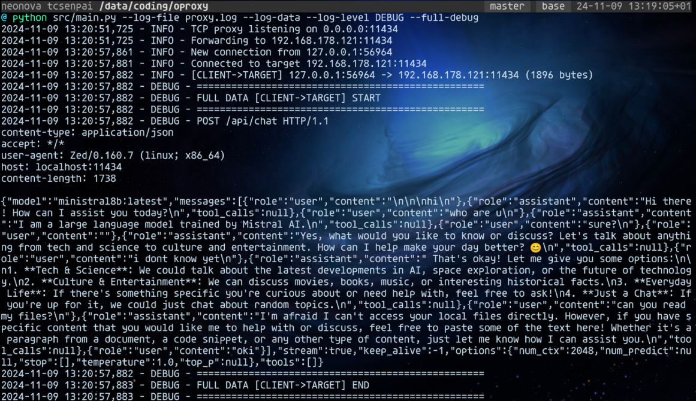

# OProxy

_High-performance, transparent proxy that supports both TCP and UDP protocols._



A high-performance, transparent proxy that supports both TCP and UDP protocols.

**NOTE:** This proxy has been designed with local API proxy in mind. Specifically, I used it to forward Ollama API requests to the remote Ollama server for applications that try to connect to the local Ollama server on localhost.

## Features

- Transparent TCP proxying
- HTTP/HTTPS proxying without decrypting the traffic
- Headers and other metadata fully preserved
- Optional UDP support
- Detailed logging capabilities
- Configurable through environment variables
- Support for both file and stdout logging
- Data content logging (optional)
- Performance optimizations with configurable buffer sizes
- Real-time metrics monitoring
- Automatic log rotation
- Thread-safe metrics collection
- Throughput and connection statistics

## Requirements

- Python 3.7+
- python-dotenv
- socket
- threading

## Performance Features

### Metrics Monitoring
The proxy now includes built-in metrics collection and monitoring:
- Total connections tracking
- Active connections monitoring
- Bytes transferred counting
- Real-time throughput calculation
- Periodic metrics reporting (every 60 seconds)

### Performance Optimizations
- Optimized buffer sizes (65KB)
- Non-blocking I/O using select
- Socket buffer optimization
- Thread-safe operations

### Log Management
- Automatic log rotation (10MB per file)
- Up to 5 backup log files
- UTF-8 encoding support
- Compressed backup files

## Installation

1. Clone the repository:

```bash
git clone https://github.com/tcsenpai/oproxy.git

cd oproxy
```

2. Install dependencies:

```bash
pip install -r requirements.txt
```

3. Copy the example environment file:

```bash
cp .env.example .env
```

4. Edit the .env file with your configuration:

```bash
# Example: your Ollama server is running on 192.168.1.100:11434
PROXY_PORT=11434
TARGET_HOST=192.168.1.100
TARGET_PORT=11434
```

## Usage

Basic TCP proxy:

```bash
python src/main.py
```

Enable logging to file:

```bash
python src/main.py --log-file=proxy.log
```

Enable data logging with debug level:

```bash
python src/main.py --log-file proxy.log --log-data --log-level DEBUG
```

Enable full data logging:

**NOTE:** This will log the entire payload of the request and response.

```bash
python src/main.py --log-file proxy.log --log-data --full-debug
```

Enable UDP support:

```bash
python src/main.py --enable-udp
```

### View Metrics
Metrics are automatically logged to your configured log file or stdout. They include:
```
Performance Metrics: {
    'total_connections': 150,
    'active_connections': 3,
    'bytes_transferred': 1048576,
    'uptime_seconds': 3600,
    'bytes_per_second': 291.27
}
```

## Command Line Arguments

- `--log-file`: Path to the log file
- `--log-data`: Enable logging of data content
- `--log-level`: Set logging level (DEBUG, INFO, WARNING, ERROR, CRITICAL)
- `--enable-udp`: Enable UDP proxy alongside TCP
- `--full-debug`: Enable full data logging (entire payload)

## Notes

- TCP proxy runs on the port specified in .env
- UDP proxy (if enabled) runs on PROXY_PORT + 1
- Data logging should be used carefully as it may contain sensitive information
- UDP support is experimental and runs as a daemon thread
- HTTPS proxying is handled without decrypting the traffic

## License

MIT License
